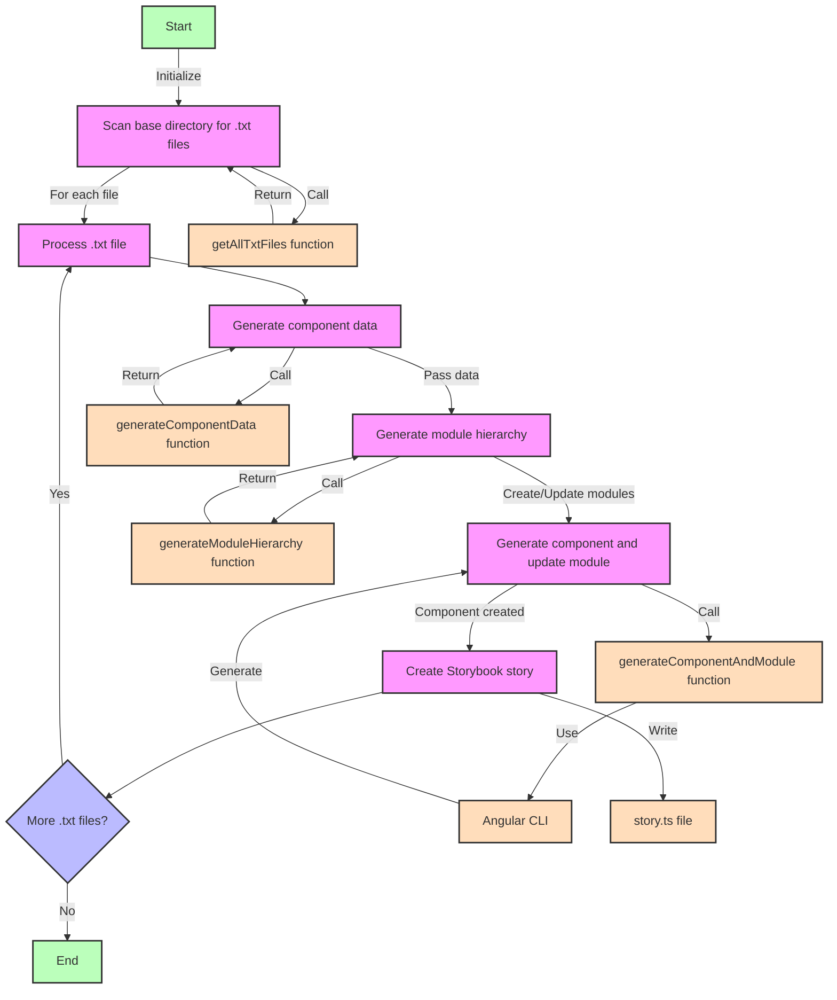
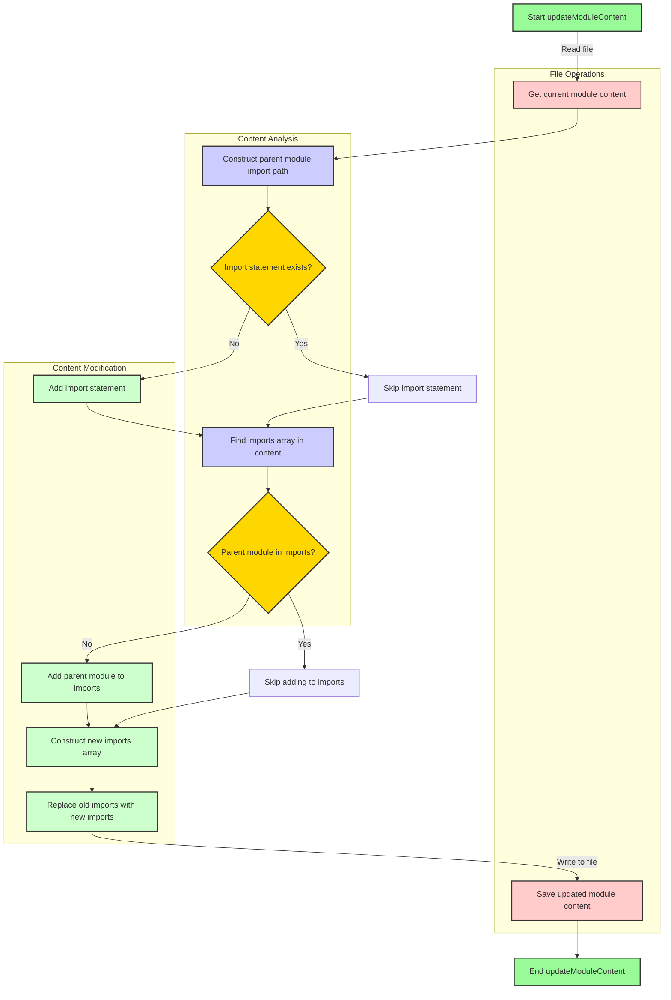
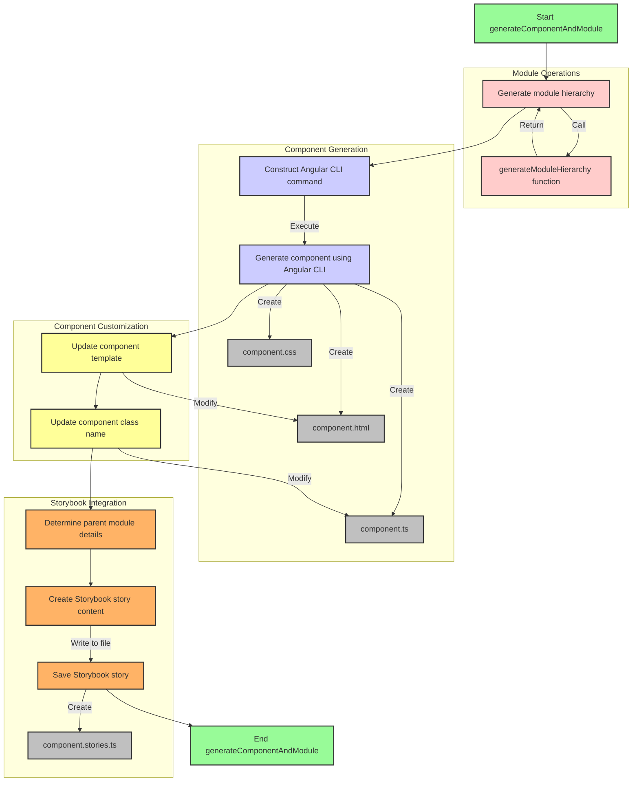

# DOCUMENTATION

## Table of Contents
1. [Introduction](#introduction)
2. [Main Process Flow](#main-process-flow)
3. [Module Update Process](#module-update-process)
4. [Component Generation Process](#component-generation-process)
5. [Key Functions](#key-functions)
6. [Usage Guide](#usage-guide)
7. [Limitations and Considerations](#limitations-and-considerations)
8. [Conclusion](#conclusion)

## Introduction

The Bulk Angular Component & Storybook Generator is a powerful Node.js script designed to automate the creation of Angular components, modules, and Storybook stories from HTML snippets. This tool significantly enhances development efficiency in large-scale Angular projects by maintaining consistency and reducing repetitive tasks.

## Main Process Flow

The main process flow of the script is illustrated in the following diagram:

This diagram outlines the primary steps of the script:

1. **Initialization**: The script starts by scanning the base directory for .txt files containing HTML snippets.
2. **File Processing**: Each .txt file is processed individually.
3. **Component Data Generation**: The script generates necessary component data based on the file content and structure.
4. **Module Hierarchy Generation**: A module hierarchy is created or updated based on the directory structure.
5. **Component and Module Generation**: The script uses Angular CLI to generate the component and update the corresponding module.
6. **Storybook Story Creation**: A Storybook story is created for each generated component.
7. **Iteration**: The process repeats for each .txt file found in the base directory.

Color coding in the diagram represents different types of operations:
- Green: Start/End points
- Pink: Main processes
- Blue: Decision points
- Orange: Input/Output operations

## Module Update Process

The module update process is a crucial part of maintaining the correct module hierarchy. This process is detailed in the following diagram:

Key steps in this process include:

1. **Reading Module Content**: The current content of the module file is read.
2. **Import Analysis**: The script checks if the necessary import statement already exists.
3. **Import Addition**: If the import doesn't exist, it's added to the module.
4. **Imports Array Update**: The imports array is updated to include the parent module if necessary.
5. **Content Update**: The modified content is written back to the module file.

Color coding in this diagram represents:
- Light Green: Start/End points
- Light Red: File operations
- Light Blue: Content analysis
- Light Green: Content modification
- Gold: Decision points

## Component Generation Process

The component generation process is at the core of this script's functionality. This process is illustrated in the following diagram:

This process involves several key steps:

1. **Module Hierarchy Generation**: Ensures the correct module structure is in place.
2. **Angular CLI Command Construction**: Prepares the command for component generation.
3. **Component Generation**: Uses Angular CLI to generate the basic component structure.
4. **Component Customization**: Updates the component template and class name.
5. **Storybook Integration**: Creates a Storybook story for the generated component.

Color coding in this diagram represents:
- Light Green: Start/End points
- Light Red: Module operations
- Light Blue: Component generation
- Light Yellow: Component customization
- Light Orange: Storybook integration
- Light Gray: File creation/modification

## Key Functions

The script relies on several key functions to perform its operations:

1. `getAllTxtFiles(dir, fileList = [])`: Recursively scans the base directory for .txt files.
2. `generateComponentData(relativeDir, fileName, originalDirParts)`: Generates component and module names and paths based on the directory structure and file names.
3. `generateModuleHierarchy(componentPath, moduleNames, dirParts)`: Creates the necessary module hierarchy and sets up imports between modules.
4. `generateComponentAndModule(...)`: Orchestrates the generation of the component, updating of the module, and creation of the Storybook story.

## Usage Guide

To use the Bulk Angular Component & Storybook Generator:

1. Ensure all prerequisites are installed (Node.js, Angular CLI, Storybook).
2. Place HTML snippets in .txt files within the `Templates/Snippets` directory.
3. Run the script using Node.js: `node path/to/bulk-generate-components.js`.
4. Review the generated components, modules, and stories.
5. Update your main app module to import the top-level generated modules.
6. Test the generated components in your Angular application and Storybook.

## Limitations and Considerations

While using this script, keep in mind the following:

1. The script assumes a specific directory structure (`Templates/Snippets`).
2. It enforces strict naming conventions which may require adjustment for existing projects.
3. Existing files are overwritten without confirmation.
4. Very complex module structures may require manual intervention.
5. For large projects, the script may take considerable time to run.

## Conclusion

The Bulk Angular Component & Storybook Generator is a powerful tool for automating Angular component creation and Storybook integration. By following a structured approach to component generation, it ensures consistency across large-scale Angular projects while significantly reducing development time.

While highly efficient, it's important to understand the script's limitations and to review the generated code to ensure it meets your project's specific needs. With proper use, this tool can greatly enhance the workflow of Angular development teams working on complex, component-heavy applications.
